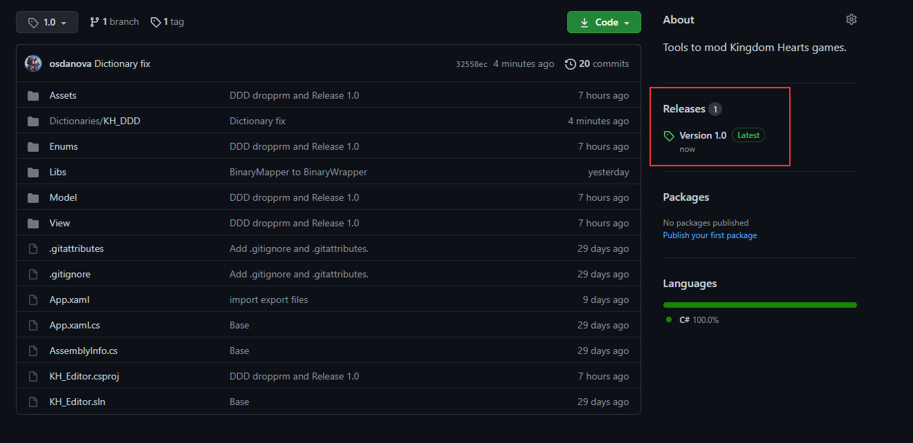
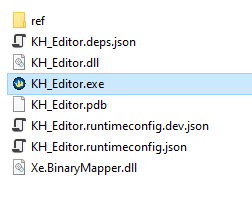
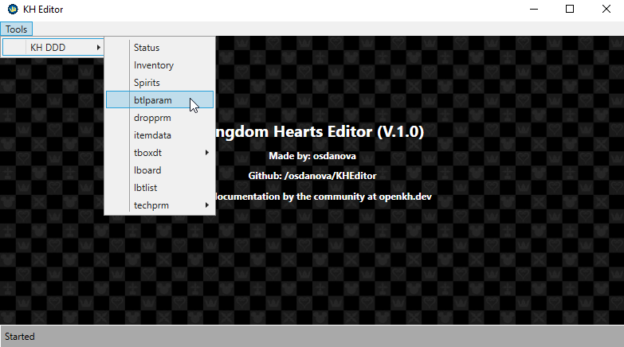
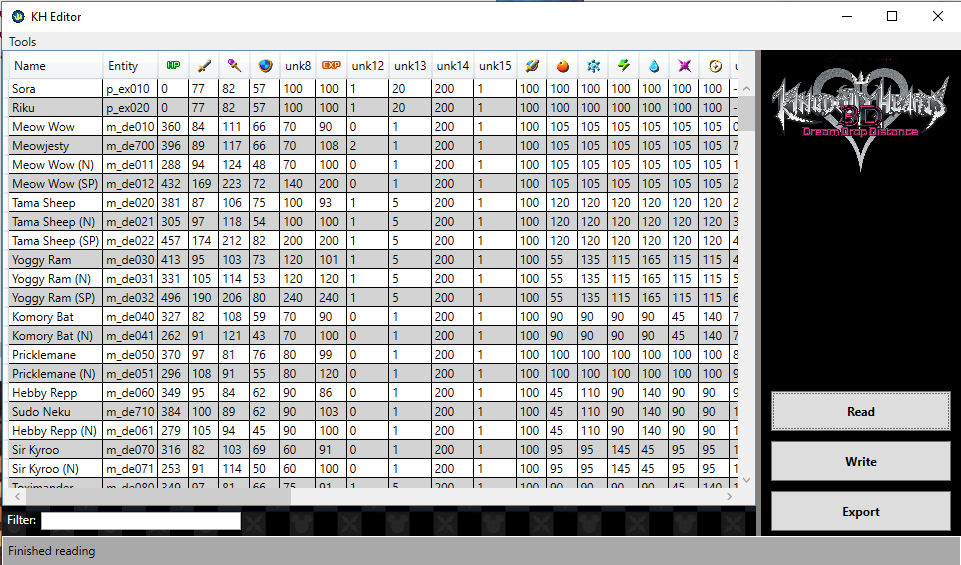

# KH Editor

This tool can edit Kingdom Hearts files in a user friendly way. You can either change values and test them in game or export the files to make your own mods using other tools.

---

## How to use

Got to Releases on the right side of Github and download the latest version.

Unzip the .zip file and execute the .exe file to open the tool.

You can check the tools currently available on the top navigation bar.

Most tools will have the same possible action.

* Drag and drop the tool's file to open the file (Make sure not to drop in other files)
* Read > Reads the file ingame if the game is open and opens it
* Write > Loads the file ingame if the game is open
* Export > Exports the file to use for a mod or other uses

---

## Available tools

Currently only available for PC

| Game | Tool      | File              | Description                                                                                            |
| ---- | --------- | ----------------- | ------------------------------------------------------------------------------------------------------ |
| DDD  | Status    | -                 | Edit the character's stats (Currently money and drop)                                                  |
| DDD  | Inventory | -                 | Edit your save's inventory                                                                             |
| DDD  | Spirits   | -                 | Edit your save's spirits                                                                               |
| DDD  | btlparam  | btlparam          | Edit entities' stats                                                                                   |
| DDD  | dropprm   | dropprm           | Edit entities' drops                                                                                   |
| DDD  | itemdata  | itemdata          | Edit items' data                                                                                       |
| DDD  | tboxdt    | tboxdtso/tboxdtri | Edit treasure chests                                                                                   |
| DDD  | lboard    | lboard            | Edit spirit boards (Open the Spirit menu twice to make sure it loads in a stable position for reading) |
| DDD  | lbtlist   | lbt_list          | Edit rewards from spirit boards                                                                        |
| DDD  | techprm   | techprm/techprmp  | Edit attack parameters                                                                                 |

---

## Credits

Tool made by: Osdanova

Thanks to the folks at openkh.dev, who keep the modding community going.

Special thanks to Xeeynamo for his BinaryMapper library, which made my work way easier.